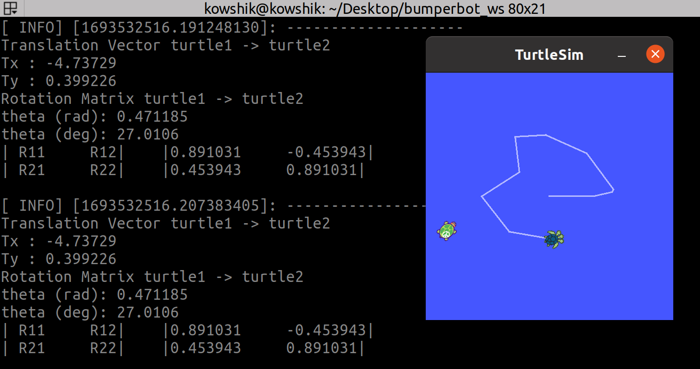
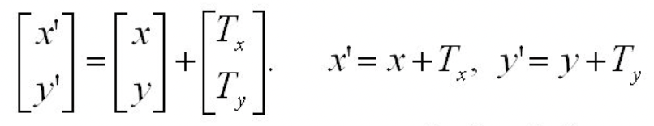
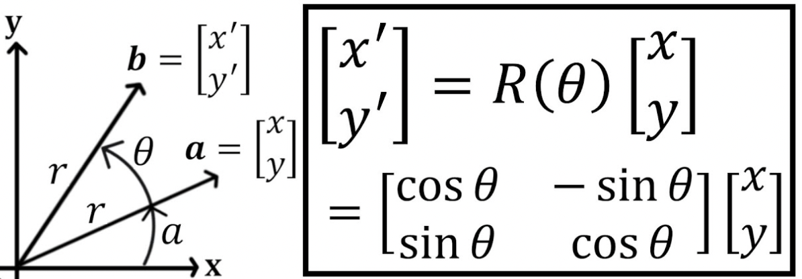

# ROS-Turtlesim-Translation-and-Rotation

## Kinematics

Equations that relate the rotational speed of the motors to the overall speed of the robot in the dimensional space.

Forward Kinematic → The equation that allows us to calculate the overall speed of the robot by knowing the rotational speed of the motors.

Inverse Kinematic → The equation that allows us to calculate the rotational speed of the motors by knowing the overall speed of the robot.

The position of the robot depends on translation and rotation.

I’ve used C++ to develop the ROS Node that calculates the translation vector among 2 turtles in the turtlesim.

I created a ROS node, that calculates the translation vector between turtle1 and turtle2, and tells at any moment in time where turtle2 is with respect to the turtle1.

## Translation Vector

## Rotation Matrix

